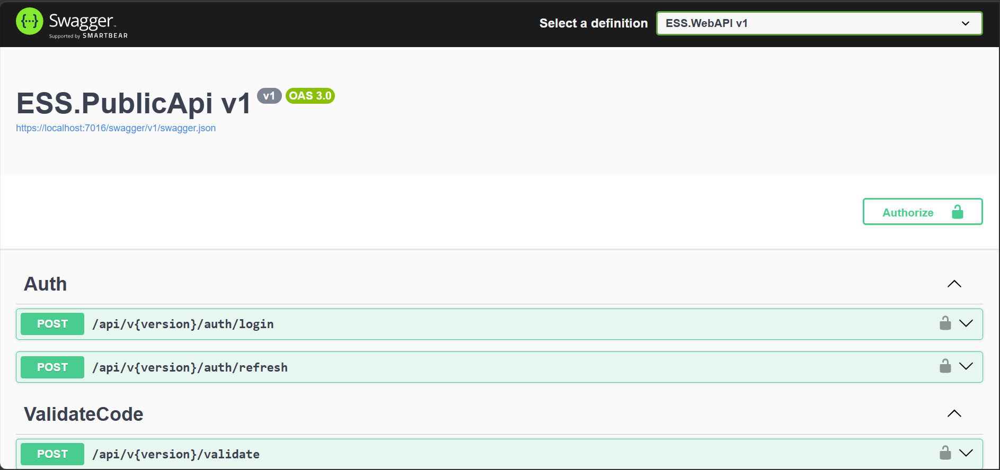
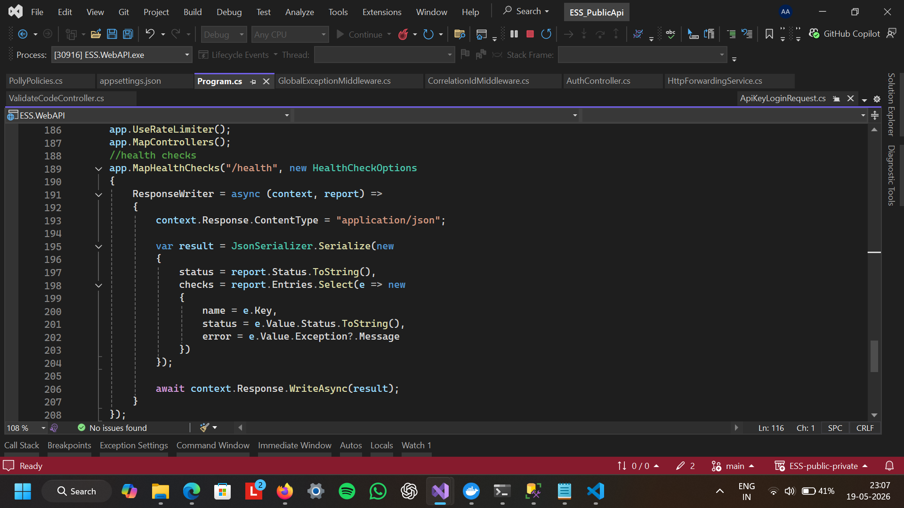
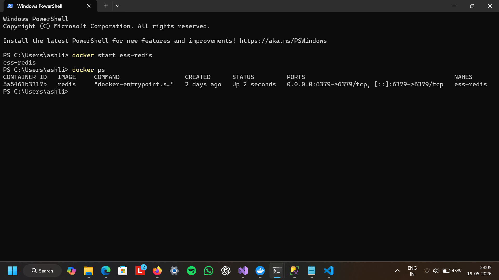

# Dotnet API Gateway

## Overview
Public/Private ASP.NET Core API architecture with JWT authentication, Redis caching, Polly resiliency patterns, Serilog logging, OpenTelemetry tracing, health checks, and API versioning.

## System Architecture

Client
   │
   ▼
Public API Gateway
   │
   ▼
Private API
   │
   ├── SQL Server
   │
   └── Redis Cache

## Features
- JWT Authentication
- Refresh Tokens
- Redis Distributed Cache
- Polly Retry & Circuit Breaker
- OpenTelemetry Tracing
- Serilog Structured Logging
- Correlation ID Middleware
- Health Checks
- API Versioning
- Rate Limiting
- Swagger Documentation

## Tech Stack

- ASP.NET Core Web API
- Entity Framework Core
- SQL Server
- Redis
- Serilog
- Polly
- OpenTelemetry
- Docker

---

## Swagger UI

---

## Health Checks

---

## Redis Running

## Running the Project
1. Clone repository
2. Configure appsettings.Development.json
3. Run Redis
4. Run Private API
5. Run Public API

## API Flow
1. Client authenticates using API Key
2. Public API forwards request to Private API
3. Private API generates JWT + Refresh Token
4. Client uses JWT for secured endpoints

## Future Improvements
- Docker Compose
- CI/CD Pipeline
- Integration Testing
- Service-to-Service Authentication
