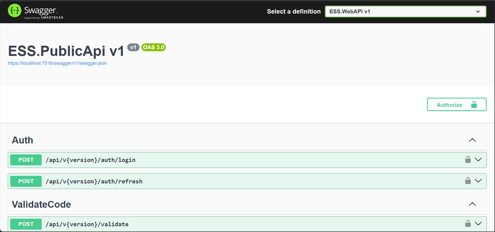
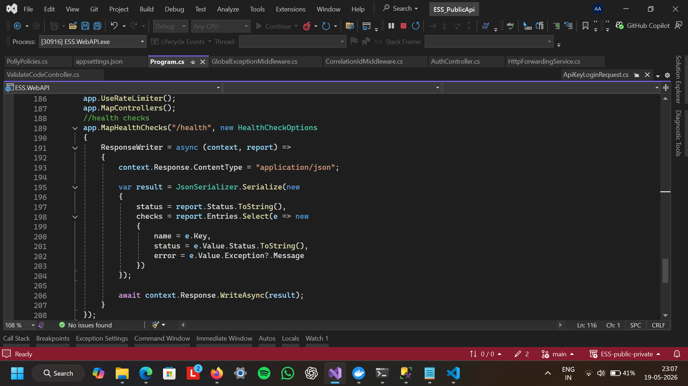
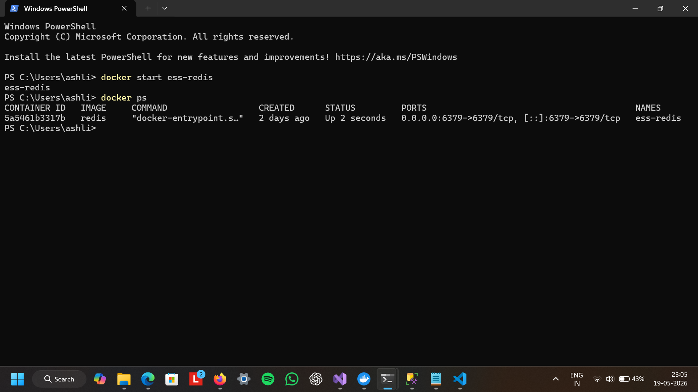

# Dotnet API Gateway


## Overview
Public/Private ASP.NET Core API architecture with JWT authentication, Redis caching, Polly resiliency patterns, Serilog logging, OpenTelemetry tracing, health checks, and API versioning.

## System Architecture

```text
Client
   │
   ▼
Public API Gateway
   │
   ▼
Private API
   │
   ├── SQL Server
   │
   └── Redis Cache
```

## Features
- JWT Authentication
- Refresh Tokens
- Redis Distributed Cache
- Polly Retry & Circuit Breaker
- OpenTelemetry Tracing
- Serilog Structured Logging
- Correlation ID Middleware
- Health Checks
- API Versioning
- Rate Limiting
- Swagger Documentation

## Tech Stack

- ASP.NET Core Web API
- Entity Framework Core
- SQL Server
- Redis
- Serilog
- Polly
- OpenTelemetry
- Docker

---

## Swagger UI



---

## Health Checks



---

## Redis Running



## Running the Project
```bash
git clone https://github.com/ASHLINANTONY98/dotnet-api-gateway.git
cd dotnet-api-gateway

docker run -d -p 6379:6379 redis

dotnet run --project ESS.PrivateApi
dotnet run --project ESS.PublicApi
```

docker run -d -p 6379:6379 redis

dotnet run --project ESS.PrivateApi
dotnet run --project ESS.PublicApi

## API Flow
1. Client sends login credentials to the Private API.
2. Private API validates credentials and issues a JWT + Refresh Token API.
3. Client includes the JWT in the Authorization header for subsequent requests.
4. Public API validates the JWT and forwards authenticated requests to the Private API.

## Future Improvements
- Docker Compose
- CI/CD Pipeline
- Integration Testing
- Service-to-Service Authentication
